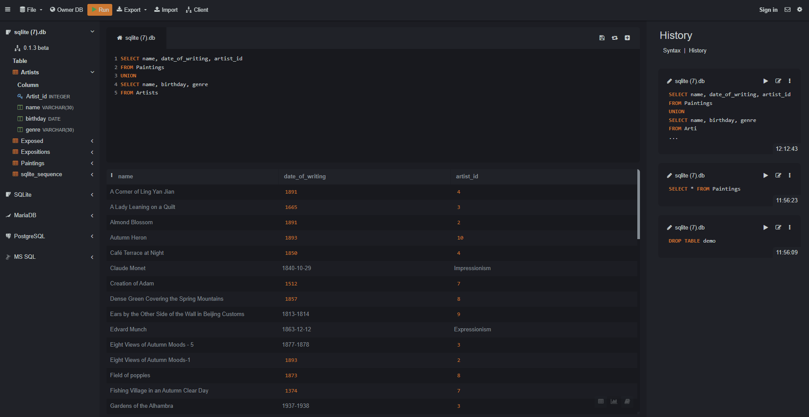
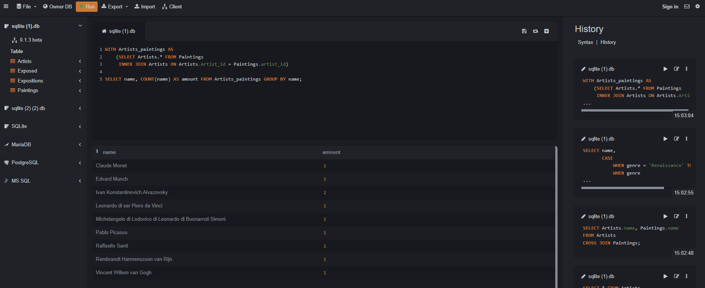

# 1.Роговая Ангелина Владимировна ИС-22/9-1
## 2.Описание базы данных "Art Gallery"


Эта база данных создана для хранения информации о картинной галерее. База данных содержит таблицы для хранения информации о выставке, авторах, изображениях и расположении картин.

### 2.1.Таблица "artist" (Художники)


- **artist_id**: уникальный идентификатор художника (INTEGER PRIMARY KEY AUTOINCREMENT)
- **name**: имя художника (VARCHAR(30))
- **birthday**: дата рождения художника (DATE)
- **genre**: жанр творчества художника (VARCHAR(30))

Пример вывода записей из таблицы "artists":
```
SELECT * FROM artists;
```

.png)


### 2.2.Таблица "exposed" (Экспозиции)

.png)

- **exposed_id**: уникальный идентификатор экспозиции (INTEGER PRIMARY KEY AUTOINCREMENT)
- **hall**: название зала, где проводится экспозиция (VARCHAR(30))
- **paintings_id**: идентификатор картины, выставленной на экспозиции (FOREIGN KEY REFERENCES Paintings(id))

Пример вывода записей из таблицы "exposed":

```
SELECT * FROM exposed;
```

.png)


### 2.3.Таблица "expositions" (Выставки)


- **expositions_id**: уникальный идентификатор выставки (INTEGER PRIMARY KEY AUTOINCREMENT)
- **theme**: тема выставки (VARCHAR(30))
- **begining**: дата начала выставки (DATE)
- **ending**: дата окончания выставки (DATE)
- **exposed_id**: идентификатор экспозиции на выставке (FOREIGN KEY REFERENCES Exposed(id))

Пример вывода записей из таблицы "expositions":

```
SELECT * FROM expositions;
```

.png)


### 2.4.Таблица "paintings" (Картины)


- **paintings_id**: уникальный идентификатор картины (INTEGER PRIMARY KEY AUTOINCREMENT)
- **name**: название картины (VARCHAR(30))
- **date_of_writing**: дата написания картины (DATE)
- **artists_id**: идентификатор художника, создавшего картину (FOREIGN KEY REFERENCES Artists(id))

Пример вывода записей из таблицы "paintings":

```
SELECT * FROM paintings;
```

.png)

## 3.UNION

```
SELECT name, date_of_writing, artist_id 
FROM paintings
UNION
SELECT name, birthday, genre
FROM artists
```



Результатом выполнения данного запроса будет таблица, содержащая следующие столбцы:
name, date_of_writing,  artist_id. 
Оператор UNION  убирает дубликаты, поэтому в результате получим только уникальные значения.
Результирующая таблица будет содержать данные из таблиц artists и paintings, объединенные по столбцам name.

## 4.ORDER BY

```
SELECT hall, painting_id
FROM exposed
ORDER BY painting_id ASC;
```


Этот запрос выбирает столбцы hall и painting_id из таблицы exposed и сортирует результат по столбцу painting_id в порядке возрастания (ASC).

## 5.HAVING 

```
SELECT expositions.theme, COUNT() AS paintings_count
FROM expositions
JOIN exposed ON expositions.exposed_id = exposed.exposed_id
GROUP BY expositions.theme
HAVING COUNT() = 1;
```

.png)

Этот запрос объединяет таблицы expositions и exposed, группирует данные по теме экспозиции (столбец theme) и выводит количество картин в каждой экспозиции. Затем используется HAVING для фильтрации результатов и оставляются только те экспозиции, в которых количество картин равно 1.

## 6.Вложенный запрос

### 6.1.SELECT

```
SELECT name, 
       (SELECT name FROM paintings WHERE artist_id = artists.artist_id) AS painting_name
FROM artists
WHERE artist_id IN (SELECT artist_id FROM paintings WHERE date_of_writing > '1700');
```
.png)

Этот запрос выбирает имена художников из таблицы artists и использует вложенный запрос для выбора названий картин, написанных после 1700 года, из таблицы paintings.

### 6.2.WHERE

```
SELECT name
FROM paintings
WHERE artist_id IN (SELECT artist_id FROM artists WHERE genre = 'Impressionism');
```


Этот запрос выберет названия картин, написанных художниками, чей жанр - импрессионизм.

## 7.Оконные функции

### 7.1.Агрегатная функция

```
SELECT expositions.theme, 
COUNT(exposed.painting_id) AS number_of_painting
FROM expositions
JOIN exposed ON Expositions.exposed_id = exposed.exposed_id
GROUP BY expositions.theme;
```

.png)

Этот запрос выбирает тему экспозиции из таблицы expositions и подсчитывает количество картин, которые были выставлены в рамках каждой экспозиции. Затем результат группируется по теме экспозиции.

### 7.2.Ранжирующая функция

```
SELECT name, birthday, RANK() OVER (ORDER BY birthday) AS artist_rank
FROM artists;
```
.png)

В результате выполнения этого запроса будут выведены имена художников, их даты рождения, а также их ранг по возрастанию даты рождения

## 7.3.Функция смещения

```
SELECT *,
       ROW_NUMBER() OVER() AS row_number
FROM paintings
ORDER BY painting_id
LIMIT 2 OFFSET 2;
```


Результат этого запроса будет представлять собой таблицу с двумя строками данных из таблицы paintings, начиная с третьей строки, отсортированных по столбцу painting_id. В результирующей таблице будет добавлен столбец row_number, содержащий порядковый номер каждой строки в результирующем наборе данных.

## 8.JOIN

### 8.1.INNER JOIN

```
SELECT * FROM artists
INNER JOIN paintings ON artists.artist_id = paintings.artist_id;
```


Результирующая таблица будет содержать все столбцы из таблиц artists и paintings, где значения artist_id будут совпадать между этими двумя таблицами. Таким образом, можно получить информацию об художниках и их произведениях, которые написаны ими.

### 8.2.LEFT JOIN

```
SELECT * FROM artists
LEFT JOIN paintings ON artists.artist_id = paintings.artist_id;
```


Результатом данного запроса будет таблица, включающая все записи из таблицы artists и только те записи из таблицы paintings, которые имеют соответствующее значение artist_id в таблице artists.

### 8.3.RIGHT JOIN

```
SELECT * FROM artists
RIGHT JOIN paintings ON artists.artist_id = paintings.artist_id;
```


Результатом данного запроса будет таблица, включающая все записи из таблицы artists и только те записи из таблицы paintings, которые имеют соответствующее значение artist_id в таблице paintings.

### 8.4.FULL OUTER JOIN

```
SELECT * FROM artists
FULL OUTER JOIN paintings ON artists.artist_id = paintings.artist_id;
```


Результатом данного запроса будет таблица, содержащая все записи из таблицы artists и все записи из таблицы paintings, включая данные об обоих сущностях, при условии их соответствия по artist_id.

### 8.5.CROSS JOIN

```
SELECT artists.name, paintings.name
FROM artists
CROSS JOIN paintings;
```


Результатом такого запроса будет таблица, в которой будет отображено сочетание каждого имени художника из таблицы artists с каждым именем картины из таблицы paintings.

## 9.CASE

```
SELECT name,
       CASE
           WHEN genre = 'Renaissance' THEN 'Baroque'
           WHEN genre = 'Impressionism' THEN 'Expressionism'
           ELSE 'Other'
       END AS artcategory
FROM artists;
```


В данном примере используется CASE-выражение для создания нового столбца "artcategory", который присваивает каждому художнику категорию искусства в зависимости от их жанра. 

## 10.WITH

```
WITH artists_paintings AS
	(SELECT artists.* FROM paintings
     INNER JOIN artists ON artists.artist_id = paintings.artist_id)
     
SELECT name, COUNT(name) as amount FROM artists_paintings GROUP BY name;
```



Результирующая таблица будет содержать два столбца: "name" - это имя художника, и "amount" - это количество картин, созданных каждым художником. Записи в таблице будут сгруппированы по именам художников, так что для каждого уникального имени будет отображено количество его картин. Таким образом, таблица покажет каждого художника и сколько у него картин в базе данных.
