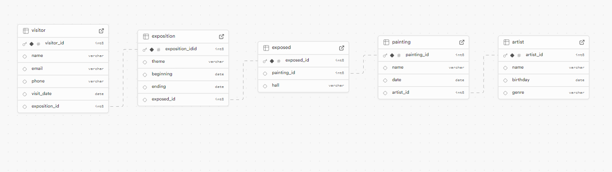
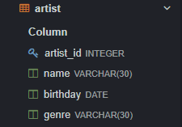
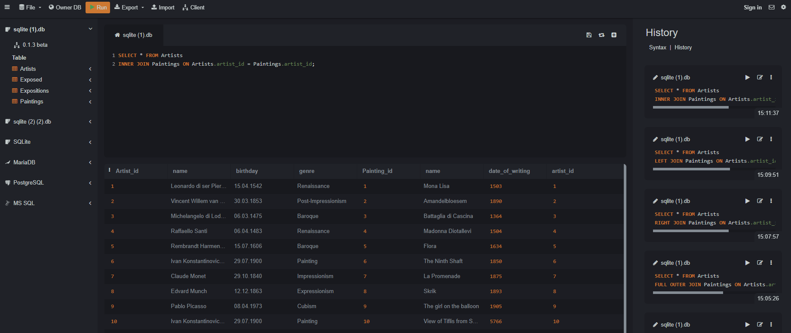

# 1.Роговая Ангелина Владимировна ИС-22/9-1
## 2.Описание базы данных "Art Gallery"



Эта база данных создана для хранения информации о картинной галерее. База данных содержит таблицы для хранения информации о выставке, авторах, изображениях и расположении картин.

### 2.1.Таблица "artist" (Художники)



- **artist_id**: уникальный идентификатор художника (INTEGER PRIMARY KEY AUTOINCREMENT)
- **name**: имя художника (VARCHAR(30))
- **birthday**: дата рождения художника (DATE)
- **genre**: жанр творчества художника (VARCHAR(30))

Пример вывода записей из таблицы "artist":
```
SELECT * FROM artist;
```

.png)


### 2.2.Таблица "exposed" (Экспозиции)

.png)

- **exposed_id**: уникальный идентификатор экспозиции (INTEGER PRIMARY KEY AUTOINCREMENT)
- **hall**: название зала, где проводится экспозиция (VARCHAR(30))
- **paintings_id**: идентификатор картины, выставленной на экспозиции (FOREIGN KEY REFERENCES Paintings(id))

Пример вывода записей из таблицы "exposed":

```
SELECT * FROM exposed;
```

.png)


### 2.3.Таблица "expositions" (Выставки)


- **expositions_id**: уникальный идентификатор выставки (INTEGER PRIMARY KEY AUTOINCREMENT)
- **theme**: тема выставки (VARCHAR(30))
- **begining**: дата начала выставки (DATE)
- **ending**: дата окончания выставки (DATE)
- **exposed_id**: идентификатор экспозиции на выставке (FOREIGN KEY REFERENCES Exposed(id))

Пример вывода записей из таблицы "exposition":

```
SELECT * FROM exposition;
```

.png)


### 2.4.Таблица "paintings" (Картины)


- **paintings_id**: уникальный идентификатор картины (INTEGER PRIMARY KEY AUTOINCREMENT)
- **name**: название картины (VARCHAR(30))
- **date_of_writing**: дата написания картины (DATE)
- **artists_id**: идентификатор художника, создавшего картину (FOREIGN KEY REFERENCES Artists(id))

Пример вывода записей из таблицы "painting":

```
SELECT * FROM painting;
```

.png)

## 3.UNION

```
SELECT name, date_of_writing, artist_id 
FROM painting
UNION
SELECT name, birthday, genre
FROM artist
```


Результатом выполнения данного запроса будет таблица, содержащая следующие столбцы:
name, date_of_writing,  artist_id. 
Оператор UNION  убирает дубликаты, поэтому в результате получим только уникальные значения.
Результирующая таблица будет содержать данные из таблиц artist и painting, объединенные по столбцам name.

## 4.ORDER BY

```
SELECT hall, painting_id
FROM exposed
ORDER BY painting_id ASC;
```


Этот запрос выбирает столбцы hall и painting_id из таблицы exposed и сортирует результат по столбцу painting_id в порядке возрастания (ASC).

## 5.HAVING 

```
SELECT exposition.theme, COUNT() AS painting_count
FROM exposition
JOIN exposed ON exposition.exposed_id = exposed.exposed_id
GROUP BY exposition.theme
HAVING COUNT() = 1;
```

.png)

Этот запрос объединяет таблицы exposition и exposed, группирует данные по теме экспозиции (столбец theme) и выводит количество картин в каждой экспозиции. Затем используется HAVING для фильтрации результатов и оставляются только те экспозиции, в которых количество картин равно 1.

## 6.Вложенный запрос

### 6.1.SELECT

```
SELECT name, 
       (SELECT name FROM painting WHERE artist_id = artist.artist_id) AS painting_name
FROM artist
WHERE artist_id IN (SELECT artist_id FROM painting WHERE date_of_writing > '1700');
```
.png)

Этот запрос выбирает имена художников из таблицы artist и использует вложенный запрос для выбора названий картин, написанных после 1700 года, из таблицы painting.

### 6.2.WHERE

```
SELECT name
FROM painting
WHERE artist_id IN (SELECT artist_id FROM artist WHERE genre = 'Impressionism');
```


Этот запрос выберет названия картин, написанных художниками, чей жанр - импрессионизм.

## 7.Оконные функции

### 7.1.Агрегатная функция

```
SELECT exposition.theme, 
COUNT(exposed.painting_id) AS number_of_painting
FROM exposition
JOIN exposed ON exposition.exposed_id = exposed.exposed_id
GROUP BY exposition.theme;
```

.png)

Этот запрос выбирает тему экспозиции из таблицы exposition и подсчитывает количество картин, которые были выставлены в рамках каждой экспозиции. Затем результат группируется по теме экспозиции.

### 7.2.Ранжирующая функция

```
SELECT name, birthday, RANK() OVER (ORDER BY birthday) AS artist_rank
FROM artist;
```
.png)

В результате выполнения этого запроса будут выведены имена художников, их даты рождения, а также их ранг по возрастанию даты рождения

## 7.3.Функция смещения

```
SELECT *,
       ROW_NUMBER() OVER() AS row_number
FROM painting
ORDER BY painting_id
LIMIT 2 OFFSET 2;
```


Результат этого запроса будет представлять собой таблицу с двумя строками данных из таблицы painting, начиная с третьей строки, отсортированных по столбцу painting_id. В результирующей таблице будет добавлен столбец row_number, содержащий порядковый номер каждой строки в результирующем наборе данных.

## 8.JOIN

### 8.1.INNER JOIN

```
SELECT * FROM artist
INNER JOIN painting ON artist.artist_id = painting.artist_id;
```


Результирующая таблица будет содержать все столбцы из таблиц artist и painting, где значения artist_id будут совпадать между этими двумя таблицами. Таким образом, можно получить информацию об художниках и их произведениях, которые написаны ими.

### 8.2.LEFT JOIN

```
SELECT * FROM artist
LEFT JOIN painting ON artist.artist_id = painting.artist_id;
```


Результатом данного запроса будет таблица, включающая все записи из таблицы artist и только те записи из таблицы painting, которые имеют соответствующее значение artist_id в таблице artist.

### 8.3.RIGHT JOIN

```
SELECT * FROM artist
RIGHT JOIN painting ON artist.artist_id = painting.artist_id;
```


Результатом данного запроса будет таблица, включающая все записи из таблицы artist и только те записи из таблицы painting, которые имеют соответствующее значение artist_id в таблице painting.

### 8.4.FULL OUTER JOIN

```
SELECT * FROM artist
FULL OUTER JOIN painting ON artist.artist_id = painting.artist_id;
```


Результатом данного запроса будет таблица, содержащая все записи из таблицы artist и все записи из таблицы painting, включая данные об обоих сущностях, при условии их соответствия по artist_id.

### 8.5.CROSS JOIN

```
SELECT artist.name, painting.name
FROM artist
CROSS JOIN painting;
```


Результатом такого запроса будет таблица, в которой будет отображено сочетание каждого имени художника из таблицы artist с каждым именем картины из таблицы painting.

## 9.CASE

```
SELECT name,
       CASE
           WHEN genre = 'Renaissance' THEN 'Baroque'
           WHEN genre = 'Impressionism' THEN 'Expressionism'
           ELSE 'Other'
       END AS artcategory
FROM artist;
```


В данном примере используется CASE-выражение для создания нового столбца "artcategory", который присваивает каждому художнику категорию искусства в зависимости от их жанра. 

## 10.WITH

```
WITH artist_painting AS
	(SELECT artist.* FROM painting
     INNER JOIN artist ON artist.artist_id = painting.artist_id)
     
SELECT name, COUNT(name) as amount FROM artist_painting GROUP BY name;
```


Результирующая таблица будет содержать два столбца: "name" - это имя художника, и "amount" - это количество картин, созданных каждым художником. Записи в таблице будут сгруппированы по именам художников, так что для каждого уникального имени будет отображено количество его картин. Таким образом, таблица покажет каждого художника и сколько у него картин в базе данных.
